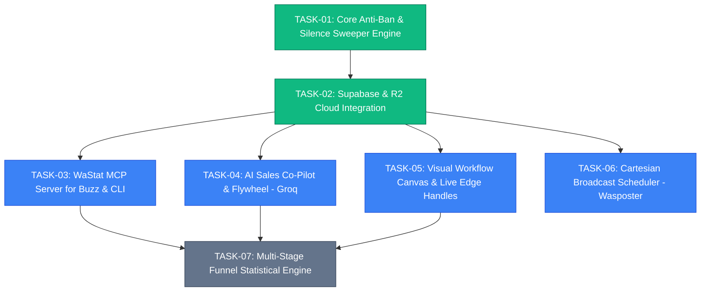

# WaStat V2 — Task Execution & Orchestration Graph (Matt Pocock Style)

This document tracks all discrete work packages for WaStat V2. Every task is designed as an **independent, tracer-bullet vertical slice** that can be assigned to autonomous sub-agents working in parallel branches without merge conflicts.

---

## 🚦 Task State Machine
- `BACKLOG`: Scoped and specified, waiting for prerequisites.
- `READY_FOR_AGENT`: Fully specified with inputs, code targets, and verification commands. Ready for immediate parallel delegation.
- `IN_PROGRESS`: Currently being executed by an agent.
- `VERIFYING`: Code written; executing automated quality gates and tests.
- `DONE`: All quality gates passed (Typecheck: 0 errors, Tests: 100% pass, Build: clean).

---

## 🗺️ Dependency Graph & Parallel Tracks

---

## 📋 Task Registry

### ✅ TASK-01: Core Anti-Ban Engine, State Machine & Silence Sweeper
- **Track**: Backend Core
- **Status**: `DONE`
- **Owner**: `Agent-Core`
- **Artifacts**:
  - `packages/shared/src/spintax.ts` (Spintax parser with nested choice resolution)
  - `packages/server/src/engine.ts` (Persistent attribute storage, 2h silence sweeper, human takeover freeze)
  - `packages/server/src/app.ts` (Background poller integration)
- **Verification**: `npm test --workspace=@wastat/server` (45/45 passing).

---

### ✅ TASK-02: Supabase PostgreSQL & Cloudflare R2 Cloud Integration
- **Track**: Infrastructure & Cloud
- **Status**: `DONE`
- **Owner**: `Agent-Infra`
- **Artifacts**:
  - `supabase/migrations/20260824000000_wastat_v2_schema.sql` (All 19 production tables)
  - `packages/server/src/media.ts` (Cloudflare R2 bucket integration)
  - `packages/server/src/supabase.ts` (Supabase client and pooled Postgres connection)
  - `docs/adr/0005-supabase-and-cloudflare-r2-architecture.md`
- **Verification**: Live Management API migration executed; 19 tables verified in Supabase public schema; R2 read/write/delete verified.

---

### 🚀 TASK-03: WaStat Native Model Context Protocol (MCP) Server
- **Track**: Developer Experience & AI Workspaces (Block Buzz / Antigravity CLI)
- **Status**: `READY_FOR_AGENT`
- **Can Run In Parallel**: `YES` (Independent package / CLI entrypoint)
- **Objective**: Expose WaStat CRM and automation engine via Model Context Protocol (JSON-RPC stdio) so developers can monitor, query, triage stuck leads, and drive actions from Block Buzz and Antigravity CLI.
- **Inputs**:
  - `packages/server/src/api.ts` (REST endpoints)
  - `packages/server/src/supabase.ts` (Database client)
- **Implementation Scope**:
  1. Create `packages/mcp-server/` workspace with `@modelcontextprotocol/sdk`.
  2. Implement Tools:
     - `wastat_get_system_summary`: Returns active sessions, total contacts by funnel phase, queued broadcast jobs, and 2-hour reply rate.
     - `wastat_list_stuck_leads`: Lists leads currently in `objection_review` or `phase_1_waiting_answer` past their 2h window.
     - `wastat_send_operator_reply`: Sends manual WhatsApp message via connected session and pauses bot for 24h.
     - `wastat_advance_phase`: 1-Click advances contact from Phase 1 to Phase 2.
     - `wastat_create_private_note`: Appends internal team note to conversation thread.
     - `wastat_trigger_broadcast`: Schedules a prioritized Cartesian group broadcast.
  3. Implement Prompts & Resources (`wastat://contacts/{id}`, `wastat://funnel/stats`).
- **Quality Gates**:
  - `npm run typecheck --workspace=@wastat/mcp-server` $\rightarrow$ 0 errors.
  - `npm test --workspace=@wastat/mcp-server` $\rightarrow$ Test stdio tool execution.

---

### 🚀 TASK-04: AI Sales Co-Pilot & Sales Learning Flywheel (Groq Llama 3.3)
- **Track**: AI Intelligence & CRM
- **Status**: `READY_FOR_AGENT`
- **Can Run In Parallel**: `YES` (Touches AI service module and Inbox AI recommendations drawer)
- **Objective**: Integrate Groq Llama 3.3 70B Versatile to implement the DeskcommCRM learning flywheel:
  1. **Mode 1 (Golden Dialogue Harvesting)**: Automatically captures successful (Customer Objection $\rightarrow$ Human Response $\rightarrow$ Phase 2 Conversion) dialogue pairs.
  2. **Mode 2 (Playbook Distillation)**: Background worker periodically distills repeated objections into approved `knowledge_playbooks`.
  3. **Mode 3 (Human-Guided Co-Pilot)**: Real-time recommendation suggestions in the operator Inbox with 1-Click "Approve & Send", "Guide AI / Adjust Tone", or "Pick Alternative".
- **Implementation Scope**:
  - `packages/server/src/ai/groq.ts`: Groq client with structured JSON output and prompt templates.
  - `packages/server/src/ai/flywheel.ts`: Dialogue harvesting and playbook extractor.
  - `packages/server/src/api.ts`: `/api/ai/suggest-reply`, `/api/ai/distill-playbooks`, `/api/playbooks`.
  - `packages/web/src/Inbox.tsx`: AI Co-Pilot recommendation card with steering input box.
- **Quality Gates**:
  - Unit tests for prompt generation and fallback response handling in `packages/server/src/ai/groq.test.ts`.

---

### 🚀 TASK-05: Visual Workflow Canvas & Live Edge Handles
- **Track**: Frontend Web
- **Status**: `READY_FOR_AGENT`
- **Can Run In Parallel**: `YES` (Isolated to `packages/web/src/WorkflowEditor.tsx` and `graph.ts`)
- **Objective**: Complete visual workflow builder with React Flow dual-handle branching and Spintax preview:
  1. **Dual Branch Handles**: Render `on_reply` (green) and `on_silence_2h` (amber) output connection handles on all question and input nodes.
  2. **Spintax Live Inspector**: Interactive Spintax preview box that shows 5 randomized generated variations in real time.
  3. **Milestone Node Drawer**: Config drawer to set milestone key, name, and conversion value.
  4. **Random Jitter Delay Visualizer**: Configure min/max seconds slider with anti-ban safety indicator.
- **Implementation Scope**:
  - `packages/web/src/WorkflowEditor.tsx`
  - `packages/web/src/graph.ts`
  - `packages/web/src/styles.css`
- **Quality Gates**:
  - `npm run typecheck --workspace=@wastat/web` $\rightarrow$ 0 errors.
  - `npm test --workspace=@wastat/web` $\rightarrow$ 100% pass.
  - `npm run build --workspace=@wastat/web` $\rightarrow$ Clean bundle output.

---

### 🚀 TASK-06: Product Catalog & Cartesian Group Broadcast Scheduler (Wasposter)
- **Track**: Marketing Automation
- **Status**: `READY_FOR_AGENT`
- **Can Run In Parallel**: `YES` (Backend scheduler & Catalog UI)
- **Objective**: Multi-product matrix dispatcher that pairs product catalog items (SKUs, Cloudflare R2 media, copy) across targeted WhatsApp groups with priority preemption (Priority 1 1-on-1 chats preempt Priority 2 broadcasts).
- **Implementation Scope**:
  - `packages/server/src/products.ts` & `packages/server/src/broadcast.ts`
  - `packages/server/src/scheduler.ts` (Priority preemption queue)
  - `packages/web/src/Products.tsx` & `packages/web/src/Broadcasts.tsx`
- **Quality Gates**:
  - Priority queue unit tests verifying that 1-on-1 customer replies take precedence over batch broadcasts.

---

### 🚀 TASK-07: Multi-Stage Funnel Analytics & Statistical Decision Engine
- **Track**: Analytics & Data Science
- **Status**: `BACKLOG` (Depends on TASK-01..05)
- **Objective**: Compute conversion rates per variant across Hook, Presentation, 2h Reply, Qualification, and Phase 2 Closing with Bayesian confidence intervals to automatically recommend winning variants.
