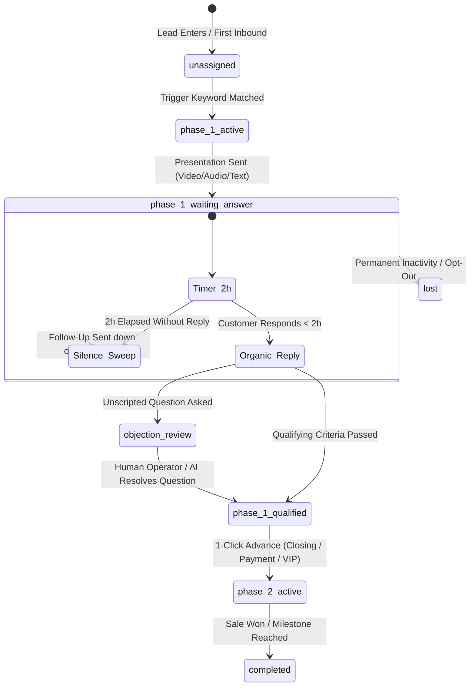

# WaStat V2 — Master Technical Architecture Blueprint

## 1. System Topology & Core Stack
- **Monorepo**: npm workspaces with TypeScript (ESM)
  - `@wastat/shared`: Core types, 31 workflow node capabilities, Spintax parser (`parseSpintax`), phrase matching algorithms.
  - `@wastat/server`: Fastify REST API, Wasender WhatsApp Web companion transport, workflow state machine, 2-hour windowed silence sweeper, Supabase PostgreSQL, Cloudflare R2 storage.
  - `@wastat/web`: React 18, Vite, React Flow (`@xyflow/react`), Live Operator Inbox, Customer 360 attributes panel, Private Team Notes.
  - `@wastat/mcp-server`: Native Model Context Protocol (MCP) server for Block Buzz and Antigravity CLI.
- **Database & Cloud Storage**:
  - **Database**: Supabase PostgreSQL (19 tables live) with Supabase Realtime pub/sub.
  - **Media Storage**: Cloudflare R2 via AWS S3 SDK (Images, Voice Notes, Product Videos, PDF Catalogs with zero egress fees).
- **AI Intelligence**:
  - Groq Llama 3.3 70B Versatile for DeskcommCRM Sales Learning Flywheel & Live Operator Co-Pilot.

---

## 2. Ubiquitous Language & Funnel State Machine

---

## 3. Anti-Ban Guardrails & Execution Policy
1. **Spintax Syntax**: Outbound copy supports nested Spintax `{Hello|{Hi|Hey}} {{contact.name}}`. Resolved dynamically per send.
2. **Random Jitter Delays**: Send delays use randomized intervals (`delay` node: `minSeconds: 3, maxSeconds: 10`) mimicking authentic human typing presence (`send_presence: "composing"`).
3. **2-Hour Attribution Window**: Outbound presentations set `silence_followup_at = now + 2h`. Responses within 2h are attributed to that variant. Silent leads receive variant-tailored follow-ups.
4. **Human Takeover Guard**: When a human operator replies manually from the Inbox or phone, `bot_status` flips to `paused_human` and freezes automated timers for 24 hours to prevent bot interference.
5. **Priority Preemption Queue**: 1-on-1 customer replies (Priority 1) immediately preempt batch group broadcasts (Priority 2).

---

## 4. Key Code Locations & APIs
- Spintax Engine: `packages/shared/src/spintax.ts`
- State Machine & Silence Sweeper: `packages/server/src/engine.ts`
- CRM & Live Inbox API: `packages/server/src/api.ts`
- Supabase Schema: `supabase/migrations/20260824000000_wastat_v2_schema.sql`
- Supabase Client: `packages/server/src/supabase.ts`
- Cloudflare R2 Storage: `packages/server/src/media.ts`
- Live Inbox & Customer 360 UI: `packages/web/src/Inbox.tsx`
- Visual Workflow Builder: `packages/web/src/WorkflowEditor.tsx`
