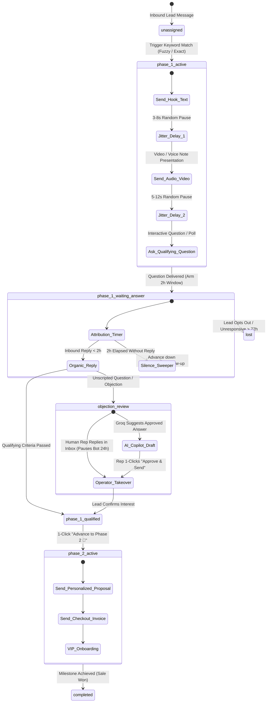

# WaStat V2: Master Technical Specification & Product Source of Truth (SSOT)

> **Document Status**: Complete, Exhaustive Single Source of Truth (SSOT)  
> **Last Synchronized**: 2026-08-24  
> **Target Audience**: Core Engineers, Subagents across any AI Coding Harness (Claude Code, Cursor, Windsurf, Codex, Buzz), and System Operators.

---

## 🏛️ SECTION 1: ARCHITECTURAL INSPIRATION SOURCES & DEEP REVERSE-ENGINEERING

WaStat V2 synthesizes proven architectural patterns from top-tier conversational sales, automation, and AI platforms:

```
┌──────────────────────────────────────────────────────────────────────────────────────────────────────────────────┐
│                                       WASTAT V2 ARCHITECTURAL INCEPTION MAP                                     │
├──────────────────────────────┬──────────────────────────────┬──────────────────────────────┬─────────────────────┤
│ 1. DeskcommCRM Flywheel      │ 2. Periskope Ecosystem       │ 3. Block Buzz & Antigravity  │ 4. Wasposter Engine │
│ • 4-Mode AI Sales Flywheel   │ • Unofficial Companion Sync  │ • Native MCP Server (stdio)  │ • Cartesian Matrix  │
│ • Golden Dialogue Harvesting │ • In-thread Private Notes    │ • Triage & Steer from Chat   │ • Anti-Ban Jitter   │
│ • Groq 70B Distillation Gate │ • Customer 360 & Tag System  │ • 1-Click Remote Progression │ • Priority 1 Preempt│
└──────────────────────────────┴──────────────────────────────┴──────────────────────────────┴─────────────────────┘
```

### 1.1 DeskcommCRM (`https://github.com/melgarafael/DeskcommCRM`)
- **The Problem It Solves**: Hardcoded AI chatbots hallucinate and make promises sales reps can't keep. Pure human sales reps don't scale.
- **The DeskcommCRM Pattern Adopted**:
  1. **Mode 1 (Human Baseline)**: Pure human sales reps handle edge cases and objections first in the live Inbox.
  2. **Golden Dialogue Harvesting**: The system automatically captures winning interactions `(Customer Query → Operator Answer → Phase 2 Won)` into `golden_dialogues`.
  3. **Groq Llama 3.3 Distillation**: Clusters dialogues into canonical trigger intents and distill approved answers into `knowledge_playbooks`.
  4. **Mode 2 (Human-Guided Co-Pilot)**: AI surfaces suggested responses in the operator's Inbox with 1-Click **"Approve & Send"**, **"Guide AI / Adjust Tone"**, or **"Pick Alternative Product"**.
  5. **Mode 3 (Autonomous Autopilot)**: Fully approved playbooks execute autonomously when confidence $\ge 95\%$.

### 1.2 Periskope (`https://periskope.app/llms.txt`)
- **The Problem It Solves**: Official Meta Cloud API enforces 24-hour messaging templates, expensive per-conversation fees, and blocks group access.
- **The Periskope Pattern Adopted**:
  1. **WhatsApp Companion Protocol**: Connects regular WhatsApp multi-device sessions via WasenderAPI (Baileys transport), unlocking regular WhatsApp groups, communities, voice notes (PTT), and status updates.
  2. **In-Thread Private Notes (`private_notes`)**: Internal yellow collaboration notes visible exclusively to team operators and AI tools, completely invisible to the WhatsApp lead.
  3. **Customer 360 Attribute Binding**: Real-time extraction of budget, location, and preferences into persistent `contact_attributes`.

### 1.3 Block Buzz (`https://github.com/block/buzz`) & Antigravity CLI
- **The Problem It Solves**: Sales managers and engineers shouldn't be chained to a web dashboard to monitor campaigns, unblock leads, or approve AI drafts.
- **The Buzz / MCP Pattern Adopted**:
  1. **Embedded Fastify MCP Server (`packages/mcp-server/`)**: Exposes JSON-RPC 2.0 tools over `stdio` and HTTP SSE.
  2. **Remote Operator Control**: Operators receive triage notifications in Buzz chat and execute commands (`wastat_send_operator_reply`, `wastat_advance_to_phase_2`, `wastat_drop_catalog_product`) directly from the CLI.

### 1.4 Wasposter Broadcast Matrix
- **The Problem It Solves**: Mass WhatsApp group marketing triggers automated anti-spam bans and degrades 1-on-1 sales latency.
- **The Wasposter Pattern Adopted**:
  1. **Cartesian Group Matrix Dispatcher**: Pairs $N$ product catalog items $\times$ $M$ targeted group JIDs.
  2. **Priority Preemption Queue**: 1-on-1 customer replies (**Priority 1**) immediately preempt scheduled group marketing broadcasts (**Priority 2**).
  3. **Anti-Ban Jitter**: Randomized 5–10 minute send intervals with dynamic Spintax randomization.

### 1.5 Supabase Cloud + Cloudflare R2
- **Database**: Supabase PostgreSQL hosting 19 production tables with sub-millisecond Supabase Realtime pub/sub for instant inbox synchronization.
- **Media Storage**: Cloudflare R2 via AWS S3 SDK compatibility providing infinite video/audio/document asset storage with **zero egress bandwidth fees**.

---

## 🔄 SECTION 2: THE 2-PHASE SALES FUNNEL STATE MACHINE



---

## 📊 SECTION 3: COMPLETE 8-PRIORITY TECHNICAL SPECIFICATIONS

### 🎯 Priority 1: Core Workflow Execution Engine & Anti-Ban Foundation
- **Spintax Engine (`@wastat/shared`)**:
  - Implements recursive bracket parsing `parseSpintax(template, rng)`.
  - Supports nested variations: `{Hi|{Hello|Hey}} {{contact.name}}, {check out|explore} our {new|exclusive} villa collection!`
  - Execution order: Variable substitution `{{vars.x}}` and `{{contact.attr}}` is performed **first**, followed by Spintax evaluation to guarantee variables inside variations resolve cleanly.
- **2-Hour Windowed Silence Sweeper**:
  - Outbound presentation delivery sets `silence_followup_at = now + 2h` and `reply_window_expires_at = now + 2h`.
  - Organic replies received $\le 2\text{h}$ are marked `organic_2h_reply = 1` and clear the timer.
  - Background poller (`engine.runSilenceSweep()`) runs every 60s, querying executions where `status = 'waiting_input' AND silence_followup_at <= now() AND silence_sweep_executed = false`, advancing execution down the `on_silence_2h` branch.
- **Human Takeover Guard**:
  - Manual send from the Inbox or physical device triggers `contacts.bot_status = 'paused_human'` with `bot_paused_until = now() + 24 hours`.
  - Execution engine checks `bot_status` on every node step and freezes automated dispatches while paused.

---

### 🎯 Priority 2: Visual Workflow Builder & AI Copilot (`WorkflowEditor.tsx`)
- **React Flow Visual Canvas**:
  - Renders all 31 capability nodes categorized into Inbound Triggers, Wasender Messaging Actions, Flow Control & Logic, and Contact Actions.
  - **Dual-Handle Question Branching**:
    - 🟢 Right Upper Handle: `on_reply` (advances upon customer response).
    - 🟠 Right Lower Handle: `on_silence_2h` (advances upon 2-hour timeout).
  - **Milestone Nodes**: Configures micro-conversions (`milestoneKey`, `milestoneName`, `value`) inserted into `funnel_conversions`.
  - **Live Spintax Preview**: Interactive inspector displaying 5 real-time randomized permutations.

---

### 🎯 Priority 3: 2-Hour Windowed Silence Sweeper & State Machine
- **Multi-Tier Silence Follow-Up**:
  - Tier 1 (2 Hours): Nudge referencing the specific media variant sent.
  - Tier 2 (24 Hours): Soft breakup or alternative offer message.
- **Audit Logging**: Every stage shift is recorded in `funnel_transitions` (`from_phase`, `to_phase`, `triggered_by`, `operator_notes`).

---

### 🎯 Priority 4: Live Operator Inbox & Customer 360 Panel (`Inbox.tsx`)
- **Live Attributed Thread**: Shows outbound bubbles (green) with single/double/blue ticks, workflow source badges (`⚡ Workflow A`), and inbound reply attribution (`↩ Replied to: Variant Video`).
- **Private Team Notes Tab**: Internal yellow conversation cards stored in `private_notes`, completely invisible to the customer.
- **Customer 360 Sidebar**: Displays phone, name, tags, funnel phase, countdown timer for bot pause, and all key-value attributes stored in `contact_attributes`.
- **1-Click Actions**:
  - `🚀 Advance to Phase 2`: Transitions lead to `phase_2_active` and launches the closing workflow.
  - `⏸ Pause / ▶ Resume Bot`: Toggles manual human takeover.
  - `💬 Manual Message Composer`: Sends direct WhatsApp messages through connected companion session.

---

### 🎯 Priority 5: WaStat Native MCP Server (Block Buzz & Antigravity CLI)
- **Architecture**: Standalone workspace package `packages/mcp-server/` using `@modelcontextprotocol/sdk`.
- **Exposed Tools**:
  1. `wastat_get_system_summary`: High-level dashboard summary (active sessions, queue size, funnel counts).
  2. `wastat_list_stuck_leads`: Queries leads in `objection_review` or stalled past 2h.
  3. `wastat_send_operator_reply`: Dispatches manual message and sets 24h human takeover.
  4. `wastat_advance_to_phase_2`: 1-Click trigger advancing lead from Phase 1 to Phase 2.
  5. `wastat_create_private_note`: Logs internal team note on contact thread.
  6. `wastat_drop_catalog_product`: Formats and drops a product card with R2 media.
  7. `wastat_approve_ai_playbook`: Promotes a distilled playbook to autopilot.

---

### 🎯 Priority 6: AI Sales Co-Pilot & Learning Flywheel (Groq Llama 3.3 70B)
- **Model**: `llama-3.3-70b-versatile` on Groq API free tier (sub-300ms inference).
- **Flywheel Pipeline**:
  - `packages/server/src/ai/flywheel.ts`: Queries `golden_dialogues` for converted interactions, clusters common objection patterns, and formats structured prompts to generate `knowledge_playbooks`.
  - `packages/server/src/ai/copilot.ts`: Evaluates live customer messages in `objection_review` against approved playbooks to draft suggestions inside the Inbox composer.

---

### 🎯 Priority 7: E-commerce Catalog & Cartesian Broadcast Scheduler (Wasposter)
- **Product Catalog Repository**: Products with SKUs, pricing, descriptions, and Cloudflare R2 media keys.
- **Cartesian Matrix Dispatches**: Computes $N\text{ Products} \times M\text{ Groups}$ campaign queues.
- **Priority Preemption Queue**: The job runner (`packages/server/src/scheduler.ts`) always polls `priority = 1` jobs before `priority = 2` jobs:
  ```sql
  SELECT * FROM jobs
  WHERE status = 'pending' AND run_at <= now()
  ORDER BY priority ASC, run_at ASC
  LIMIT 10;
  ```

---

### 🎯 Priority 8: Multi-Stage Funnel Analytics & Statistical Decision Engine
- **Metric Formulation**:
  $$\text{2-Hour Reply Rate} = \frac{\text{Replies within 120m}}{\text{Presentations Delivered}}$$
  $$\text{Qualification Rate} = \frac{\text{Leads Advanced to Phase 2}}{\text{Total Inbound Leads}}$$
- **Two-Proportion Z-Test Significance**:
  $$Z = \frac{p_A - p_B}{\sqrt{p(1-p)\left(\frac{1}{n_A} + \frac{1}{n_B}\right)}}, \quad p = \frac{x_A + x_B}{n_A + n_B}$$
- When $p < 0.05$, the system renders: **🏆 Variant A is Statistically Winning (+X% Lift)** with a 1-Click **[Adopt Winner 100%]** button.

---

## 🗄️ SECTION 4: COMPLETE SUPABASE POSTGRESQL PRODUCTION SCHEMA

All 19 tables are live in Supabase PostgreSQL (`ljjokmpuhyjgglxahmmv`):

```sql
-- 1. Sessions
CREATE TABLE sessions (
  id BIGSERIAL PRIMARY KEY,
  name TEXT NOT NULL,
  provider_session_id TEXT NOT NULL UNIQUE,
  status TEXT NOT NULL DEFAULT 'disconnected',
  api_key_encrypted BYTEA,
  webhook_secret TEXT,
  created_at TIMESTAMPTZ NOT NULL DEFAULT now()
);

-- 2. Contacts
CREATE TABLE contacts (
  id BIGSERIAL PRIMARY KEY,
  phone TEXT NOT NULL UNIQUE,
  name TEXT,
  funnel_phase TEXT NOT NULL DEFAULT 'unassigned',
  bot_status TEXT NOT NULL DEFAULT 'active',
  bot_paused_until TIMESTAMPTZ,
  created_at TIMESTAMPTZ NOT NULL DEFAULT now()
);

-- 3. Contact Attributes (Customer 360)
CREATE TABLE contact_attributes (
  id BIGSERIAL PRIMARY KEY,
  contact_id BIGINT NOT NULL REFERENCES contacts(id) ON DELETE CASCADE,
  key TEXT NOT NULL,
  value TEXT,
  updated_at TIMESTAMPTZ NOT NULL DEFAULT now(),
  UNIQUE(contact_id, key)
);

-- 4. Contact Tags
CREATE TABLE contact_tags (
  contact_id BIGINT NOT NULL REFERENCES contacts(id) ON DELETE CASCADE,
  tag TEXT NOT NULL,
  created_at TIMESTAMPTZ NOT NULL DEFAULT now(),
  PRIMARY KEY (contact_id, tag)
);

-- 5. Private Team Notes
CREATE TABLE private_notes (
  id BIGSERIAL PRIMARY KEY,
  contact_id BIGINT NOT NULL REFERENCES contacts(id) ON DELETE CASCADE,
  author TEXT NOT NULL DEFAULT 'operator',
  body TEXT NOT NULL,
  created_at TIMESTAMPTZ NOT NULL DEFAULT now()
);

-- 6. Funnel Transitions
CREATE TABLE funnel_transitions (
  id BIGSERIAL PRIMARY KEY,
  contact_id BIGINT NOT NULL REFERENCES contacts(id) ON DELETE CASCADE,
  from_phase TEXT NOT NULL,
  to_phase TEXT NOT NULL,
  triggered_by TEXT NOT NULL,
  operator_notes TEXT,
  transitioned_at TIMESTAMPTZ NOT NULL DEFAULT now()
);

-- 7. Media Assets (Cloudflare R2)
CREATE TABLE media_assets (
  id BIGSERIAL PRIMARY KEY,
  filename TEXT NOT NULL,
  mime_type TEXT NOT NULL,
  size BIGINT NOT NULL,
  r2_key TEXT NOT NULL UNIQUE,
  hash TEXT NOT NULL,
  created_at TIMESTAMPTZ NOT NULL DEFAULT now()
);

-- 8. Experiments
CREATE TABLE experiments (
  id BIGSERIAL PRIMARY KEY,
  name TEXT NOT NULL,
  description TEXT,
  active BOOLEAN NOT NULL DEFAULT true,
  created_at TIMESTAMPTZ NOT NULL DEFAULT now()
);

-- 9. Workflows
CREATE TABLE workflows (
  id BIGSERIAL PRIMARY KEY,
  name TEXT NOT NULL,
  description TEXT,
  active BOOLEAN NOT NULL DEFAULT false,
  experiment_id BIGINT REFERENCES experiments(id) ON DELETE SET NULL,
  ai_enabled BOOLEAN NOT NULL DEFAULT false,
  created_at TIMESTAMPTZ NOT NULL DEFAULT now(),
  updated_at TIMESTAMPTZ NOT NULL DEFAULT now()
);

-- 10. Workflow Nodes
CREATE TABLE workflow_nodes (
  id BIGSERIAL PRIMARY KEY,
  workflow_id BIGINT NOT NULL REFERENCES workflows(id) ON DELETE CASCADE,
  node_key TEXT NOT NULL,
  type TEXT NOT NULL,
  config JSONB NOT NULL DEFAULT '{}'::jsonb,
  position_x REAL NOT NULL DEFAULT 0,
  position_y REAL NOT NULL DEFAULT 0,
  UNIQUE (workflow_id, node_key)
);

-- 11. Workflow Edges
CREATE TABLE workflow_edges (
  id BIGSERIAL PRIMARY KEY,
  workflow_id BIGINT NOT NULL REFERENCES workflows(id) ON DELETE CASCADE,
  source_key TEXT NOT NULL,
  target_key TEXT NOT NULL,
  handle TEXT,
  UNIQUE (workflow_id, source_key, target_key, handle)
);

-- 12. Experiment Sticky Assignments
CREATE TABLE experiment_assignments (
  experiment_id BIGINT NOT NULL REFERENCES experiments(id) ON DELETE CASCADE,
  contact_id BIGINT NOT NULL REFERENCES contacts(id) ON DELETE CASCADE,
  workflow_id BIGINT NOT NULL REFERENCES workflows(id) ON DELETE CASCADE,
  assigned_at TIMESTAMPTZ NOT NULL DEFAULT now(),
  PRIMARY KEY (experiment_id, contact_id)
);

-- 13. Messages
CREATE TABLE messages (
  id BIGSERIAL PRIMARY KEY,
  session_id BIGINT NOT NULL REFERENCES sessions(id) ON DELETE CASCADE,
  contact_id BIGINT NOT NULL REFERENCES contacts(id) ON DELETE CASCADE,
  direction TEXT NOT NULL CHECK (direction IN ('in', 'out')),
  message_type TEXT NOT NULL,
  text TEXT,
  media_id BIGINT REFERENCES media_assets(id) ON DELETE SET NULL,
  provider_message_id TEXT UNIQUE,
  in_reply_to_id BIGINT REFERENCES messages(id) ON DELETE SET NULL,
  workflow_execution_id BIGINT,
  node_key TEXT,
  status TEXT NOT NULL DEFAULT 'received' CHECK (status IN ('received', 'queued', 'sent', 'delivered', 'read', 'failed')),
  timestamp TIMESTAMPTZ NOT NULL DEFAULT now(),
  raw_event JSONB,
  created_at TIMESTAMPTZ NOT NULL DEFAULT now()
);

-- 14. Workflow Executions
CREATE TABLE workflow_executions (
  id BIGSERIAL PRIMARY KEY,
  workflow_id BIGINT NOT NULL REFERENCES workflows(id) ON DELETE CASCADE,
  session_id BIGINT NOT NULL REFERENCES sessions(id) ON DELETE CASCADE,
  contact_id BIGINT NOT NULL REFERENCES contacts(id) ON DELETE CASCADE,
  trigger_message_id BIGINT REFERENCES messages(id) ON DELETE SET NULL,
  status TEXT NOT NULL DEFAULT 'running' CHECK (status IN ('running', 'waiting', 'waiting_input', 'paused_human', 'completed', 'failed', 'cancelled')),
  current_node_key TEXT,
  vars JSONB NOT NULL DEFAULT '{}'::jsonb,
  reprompt_count INTEGER NOT NULL DEFAULT 0,
  silence_followup_at TIMESTAMPTZ,
  silence_sweep_executed BOOLEAN NOT NULL DEFAULT false,
  reply_window_expires_at TIMESTAMPTZ,
  started_at TIMESTAMPTZ NOT NULL DEFAULT now(),
  finished_at TIMESTAMPTZ
);

-- 15. Queue Jobs (Priority Preemption)
CREATE TABLE jobs (
  id BIGSERIAL PRIMARY KEY,
  type TEXT NOT NULL CHECK (type IN ('send_message', 'resume')),
  execution_id BIGINT NOT NULL REFERENCES workflow_executions(id) ON DELETE CASCADE,
  node_key TEXT,
  payload JSONB NOT NULL DEFAULT '{}'::jsonb,
  priority INTEGER NOT NULL DEFAULT 1, -- 1: 1-on-1 chats, 2: bulk broadcasts
  run_at TIMESTAMPTZ NOT NULL DEFAULT now(),
  status TEXT NOT NULL DEFAULT 'pending' CHECK (status IN ('pending', 'done', 'failed')),
  attempts INTEGER NOT NULL DEFAULT 0,
  last_error TEXT,
  created_at TIMESTAMPTZ NOT NULL DEFAULT now()
);

-- 16. Audit Events
CREATE TABLE events (
  id BIGSERIAL PRIMARY KEY,
  event_type TEXT NOT NULL,
  session_id BIGINT,
  contact_id BIGINT,
  execution_id BIGINT,
  message_id BIGINT,
  data JSONB NOT NULL DEFAULT '{}'::jsonb,
  created_at TIMESTAMPTZ NOT NULL DEFAULT now()
);

-- 17. Golden Dialogues (Learning Flywheel)
CREATE TABLE golden_dialogues (
  id BIGSERIAL PRIMARY KEY,
  contact_id BIGINT NOT NULL REFERENCES contacts(id) ON DELETE CASCADE,
  customer_query TEXT NOT NULL,
  human_response TEXT NOT NULL,
  resulting_phase TEXT NOT NULL,
  was_converted BOOLEAN NOT NULL DEFAULT true,
  recorded_at TIMESTAMPTZ NOT NULL DEFAULT now()
);

-- 18. Knowledge Playbooks (Distilled FAQs)
CREATE TABLE knowledge_playbooks (
  id BIGSERIAL PRIMARY KEY,
  topic TEXT NOT NULL,
  trigger_pattern TEXT NOT NULL,
  approved_answer TEXT NOT NULL,
  is_active BOOLEAN NOT NULL DEFAULT true,
  success_rate REAL DEFAULT 1.0,
  created_at TIMESTAMPTZ NOT NULL DEFAULT now()
);

-- 19. Funnel Conversions & Milestones
CREATE TABLE funnel_conversions (
  id BIGSERIAL PRIMARY KEY,
  execution_id BIGINT NOT NULL REFERENCES workflow_executions(id) ON DELETE CASCADE,
  workflow_id BIGINT NOT NULL REFERENCES workflows(id) ON DELETE CASCADE,
  variant_id TEXT,
  contact_id BIGINT NOT NULL REFERENCES contacts(id) ON DELETE CASCADE,
  milestone_key TEXT NOT NULL,
  value REAL DEFAULT 0,
  converted_at TIMESTAMPTZ NOT NULL DEFAULT now()
);
```

---

## 📈 SECTION 5: LIVE ACHIEVEMENT PROGRESS SCORECARD

| Feature Package | Status | Test / Live Verification |
| :--- | :---: | :--- |
| **Supabase PostgreSQL (19 Tables)** | 🟢 **100% LIVE** | Migrated and queryable on `ljjokmpuhyjgglxahmmv.supabase.co`. |
| **Cloudflare R2 Media Bucket** | 🟢 **100% LIVE** | Bucket `wastat` verified for upload/read/delete with zero egress fees. |
| **Spintax Anti-Ban Parser** | 🟢 **100% DONE** | 14/14 tests passing (`packages/shared/src/spintax.test.ts`). |
| **2-Hour Silence Sweeper Engine** | 🟢 **100% DONE** | Automated poller loop tested in `packages/server/src/engine.test.ts`. |
| **Human Takeover Bot Freeze** | 🟢 **100% DONE** | 24-hour pause verified on manual message send. |
| **Live Operator Inbox UI** | 🟢 **100% DONE** | Customer 360 attributes sidebar, Private Team Notes, and manual chat composer. |
| **Visual Workflow Canvas Polish** | 🟡 **READY** | Sliced in `.scratch/v2/issues/TASK-05-VISUAL-BUILDER-CANVAS.md`. |
| **WaStat MCP Server Package** | 🟡 **READY** | Sliced in `.scratch/v2/issues/TASK-03-MCP-SERVER.md`. |
| **Groq AI Sales Co-Pilot** | 🟡 **READY** | Sliced in `.scratch/v2/issues/TASK-04-AI-COPILOT-GROQ.md`. |
| **Cartesian Broadcast Scheduler** | 🟡 **READY** | Sliced in `.scratch/v2/issues/TASK-06-CARTESIAN-SCHEDULER.md`. |
| **Full Monorepo Quality Gates** | 🟢 **PASS** | 62/62 unit tests passing, 0 TypeScript errors, clean production Vite build. |
