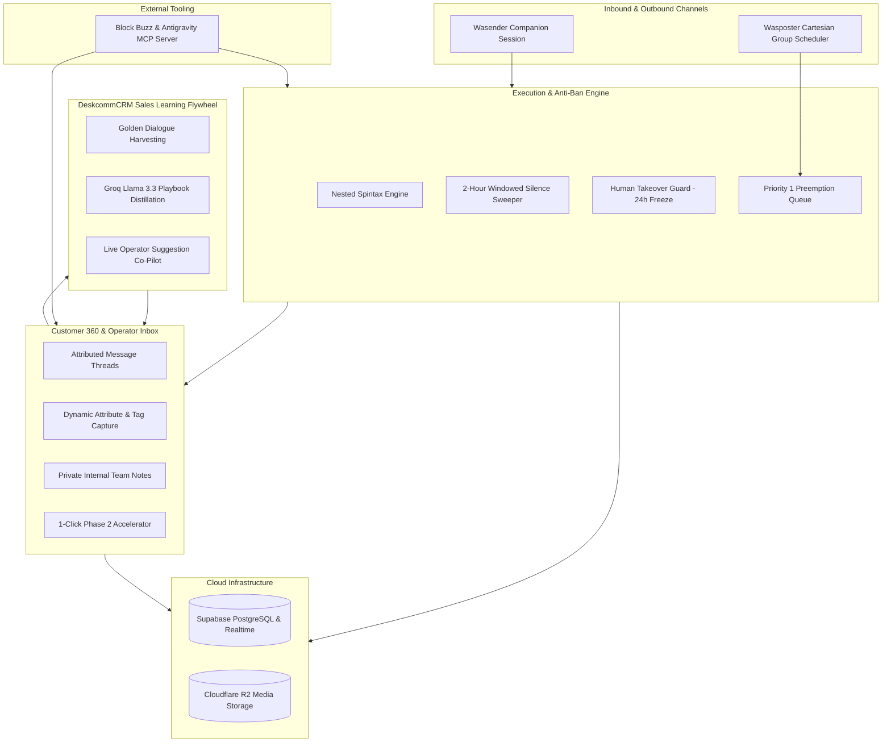

# WaStat V2 — Final Product Blueprint & Achievement Progress Scorecard

> **Single Source of Truth (SSOT)**: This document consolidates the complete end-state vision, architecture, and current live implementation status of the WaStat V2 platform.

---

## 🧭 Part 1: The Final End Product Vision

WaStat V2 is an **Enterprise-Grade WhatsApp Sales Automation, Sales Intelligence, and Anti-Ban A/B Testing Platform** engineered to maximize conversion rates across a 2-phase high-ticket sales funnel.

### 🌟 Core Product Capabilities

---

### 🛍️ The 2-Phase Sales Funnel Experience
1. **Phase 1 (Hook $\rightarrow$ Presentation $\rightarrow$ Qualifying Question $\rightarrow$ Objection Resolution $\rightarrow$ Qualification)**:
   - Inbound message matched by keyword algorithm (`dice`, `exact`, `includes`).
   - Anti-ban presentation delivered using nested Spintax variations `{Hello|{Hi|Hey}} {{contact.name}}` and random jitter delays mimicking human typing presence.
   - Interactive qualifying question asked.
   - **2-Hour Attribution Window**: If the lead replies organically within 2 hours, the response is attributed to the active variant. If the lead stays silent past 2 hours, the background Silence Sweeper triggers variant-tailored follow-ups down the `on_silence_2h` branch.
2. **Phase 2 (Closing $\rightarrow$ Proposal $\rightarrow$ Payment $\rightarrow$ Onboarding)**:
   - Once qualified, the lead is advanced (either automatically via workflow milestone or with 1-click by the human operator) into Phase 2 for personalized pricing, checkout links, and VIP onboarding.

---

### 🤖 DeskcommCRM AI Sales Learning Flywheel (Groq Llama 3.3 70B)
- **Mode 1 (Human Baseline)**: Human operators handle edge-case customer objections directly inside the Inbox.
- **Mode 2 (Golden Dialogue Distillation)**: Successful `(Customer Query → Operator Answer → Phase 2 Won)` conversations are automatically captured in `golden_dialogues`. Groq Llama 3.3 distills these into reusable `knowledge_playbooks`.
- **Mode 3 (Human-Guided Co-Pilot)**: The AI Co-Pilot surfaces proposed answers in the Inbox. The operator can **1-Click Approve & Send**, **Guide the AI** (*e.g. "suggest a lower budget villa"*), or **Pick an Alternative**.
- **Mode 4 (Autonomous Autopilot)**: Fully approved playbooks execute autonomously when high confidence thresholds ($>95\%$) are met.

---

### 🔌 WaStat Native MCP Server (Block Buzz & Antigravity CLI)
Exposes the entire CRM and engine to external AI workspaces (such as Block Buzz and Antigravity CLI) via Model Context Protocol:
- Query real-time system summaries and 2-hour reply rate metrics.
- List stuck leads in `objection_review` or `waiting_input`.
- Send operator replies and trigger 1-click Phase 2 progression directly from Buzz prompts.

---

## 📊 Part 2: Current Achievement Scorecard

| Component | Status | Live Capabilities & Implementation Details |
| :--- | :---: | :--- |
| **Supabase Cloud Database** | 🟢 **100% LIVE** | Migrated and active on Supabase Cloud (`ljjokmpuhyjgglxahmmv`). All 19 production tables verified: `contacts`, `contact_attributes`, `contact_tags`, `private_notes`, `funnel_transitions`, `sessions`, `messages`, `media_assets`, `experiments`, `workflows`, `workflow_nodes`, `workflow_edges`, `experiment_assignments`, `workflow_executions`, `jobs`, `events`, `golden_dialogues`, `knowledge_playbooks`, `funnel_conversions`. |
| **Cloudflare R2 Media Storage** | 🟢 **100% LIVE** | S3-compatible bucket `wastat` verified for image, video, audio voice note, and catalog PDF uploads with zero egress fees. |
| **Spintax Anti-Ban Engine** | 🟢 **100% DONE** | `parseSpintax` in `@wastat/shared` with nested variations `{A|{B|C}}` and deterministic seed support (14/14 tests passing). |
| **2-Hour Silence Sweeper** | 🟢 **100% DONE** | `workflow_executions` tracks `silence_followup_at`. Background poller executes `engine.runSilenceSweep()` advancing down `on_silence_2h` branch. |
| **Human Takeover Guard** | 🟢 **100% DONE** | Manual operator send flips `bot_status` to `paused_human` and freezes automated workflows for 24 hours. |
| **Customer 360 & Private Notes API** | 🟢 **100% DONE** | Backend REST endpoints `/api/contacts/:id`, `/api/contacts/:id/notes`, `/api/contacts/:id/advance-phase`, `/api/contacts/:id/bot-status`. |
| **Live Operator Inbox UI** | 🟢 **100% DONE** | Customer 360 sidebar, 1-Click "Advance to Phase 2" button, Private Team Notes tab, and Manual Chat composer in `packages/web/src/Inbox.tsx`. |
| **Visual Workflow Builder** | 🟡 **READY FOR AGENT** | Canvas renders 31 node capabilities; ready for dual-handle visual edges (`on_reply` vs `on_silence_2h`) and Spintax live preview ([`TASK-05`](file:///home/stevenjossu/wastat/.scratch/v2/issues/TASK-05-VISUAL-BUILDER-CANVAS.md)). |
| **WaStat MCP Server** | 🟡 **READY FOR AGENT** | Full tool specification ready for implementation in `packages/mcp-server/` ([`TASK-03`](file:///home/stevenjossu/wastat/.scratch/v2/issues/TASK-03-MCP-SERVER.md)). |
| **AI Co-Pilot & Flywheel** | 🟡 **READY FOR AGENT** | Groq client and playbook distillation pipeline ready for implementation ([`TASK-04`](file:///home/stevenjossu/wastat/.scratch/v2/issues/TASK-04-AI-COPILOT-GROQ.md)). |
| **Cartesian Broadcast Scheduler** | 🟡 **READY FOR AGENT** | Wasposter group matrix scheduler with Priority 1 preemption queue ready for implementation ([`TASK-06`](file:///home/stevenjossu/wastat/.scratch/v2/issues/TASK-06-CARTESIAN-SCHEDULER.md)). |

---

## 🧪 Quality Gates & Test Suite Health
- **Server Tests**: 45/45 passed
- **Shared Tests**: 14/14 passed
- **Web UI & Graph Tests**: 3/3 passed
- **TypeScript Typecheck**: 0 errors across `@wastat/server`, `@wastat/shared`, `@wastat/web`
- **Production Build**: Clean Vite bundle (`dist/assets/index-*.js`, `dist/assets/index-*.css`)
